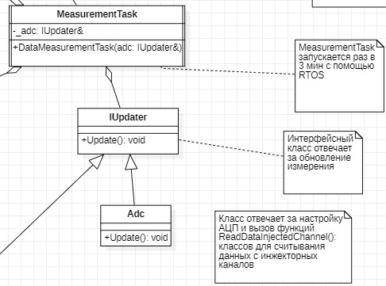

:toc: macro

= Описание архитектуры

Условно архитектура программы разделена несколько частей: 

toc::[]

== MeasurementTask

.UML диаграмма группы MeasurementTask
image::UML_Diag_MeasurementTask.jpg[]

=== Связь MeasurementTask с Adc

.UML диаграмма MeasurementTask с Adc

Система реального времени в классе MeasurementTask вызывает функцию Execute(), в которой расположен бесконечный цикл и уже в нем вызывается функция Update() интерфейса IUpdater, так как класс Adc наследует класс IUpdater,  вызывается функция класса adc, после "засыпает" на 3 мин и цикл повторяется. 

.measurementTask.h
[source, cpp]
----
#ifndef MEASUREMENTTASK
#define MEASUREMENTTASK

#include "thread.hpp" //For OsWrapper::Thread

class MeasurementTask : public OsWrapper::Thread<128>
{
  public:
    MeasurementTask(IUpdater& adc) : _adc(adc){}
    void Execute() override
    {
      for(;;)
      {
        _adc.Update();
        Sleep(180000ms);
      }
    }
private:
  IUpdater& _adc;  
};

#endif //MEASUREMENTTASK
----

.iUpdater.h
[source, cpp]
----
#ifndef IUPDATER
#define IUPDATER

class IUpdater
{
  public:
    virtual void Update() const = 0;
  
};
#endif
----

Класс adc отвечает за настройку АЦП и вызов функций классов для считывания данных с инжекторных каналов. В классе на данный момент реализован вывод строки в терминале для реализации работы MeasurementTask 

.adc.h
[source, cpp]
----
#ifndef ADC
#define ADC

#include "iUpdater.h"
#include <iostream> // TODO удалить после настройки класса АЦП

class Adc : public IUpdater
{
public:
  void Update() const override
  {
    std::cout << "adc"; // TODO удалить после настройки класса АЦП 
  }
  
};
#endif
----

== Adc

.UML диаграмма группы Adc
image::UML_Diag_Adc.jpg[]

Функция *_Update_* класса *Adc* который запускает работу АЦП и считывает данные с инжекторных каналов, далее вызывается функция *_SetData_*, интерфейса *IInjectedChannel*, который в свою очередь устанавливает данные в объекте класса *InjectedChannel*, соответствующий определенному инжекторному каналу. Установленные данные необходимо передать в другой класс, за передачу данных отвечает интерфейс *IDataProvider* с функцией *_GetData_*.

.iinjectedchannel.h
[source, cpp]
----
#ifndef IINJECTEDCHANNEL
#define IINJECTEDCHANNEL

class IInjectedChannel
{
  public:
    virtual void SetData(std::uint32_t data) = 0;
};

#endif
----

.idataprovider.h
[source, cpp]
----
#ifndef IDATAPROVIDER
#define IDATAPROVIDER

class IDataProvider
{
  public:
    virtual std::uint32_t GetData() const = 0;
};

#endif
----

Класс InjectedChannel, разбит на заголовочный файл .h и файл исходного кода .cpp.

.injectedchannel.h
[source, cpp]
----
#ifndef INJECTEDCHANNEL
#define INJECTEDCHANNEL

#include "iinjectedchannel.h" // for IInjectedChannel 
#include "idataprovider.h" // for IDataProvider

class InjectedChannel : public IInjectedChannel, IDataProvider
{
  public:
    void SetData(std::uint32_t data);
    
    std::uint32_t GetData();
  private:
    std::uint32_t mData;
};

#endif
----

.injectedchannel.cpp
[source, cpp]
----
#include "injectedchannel.h" // for InjectedChannel

void InjectedChannel::SetData(std::uint32_t data) override
{
  mData = data;
}

std::uint32_t InjectedChannel::GetData() const override
{
  return mData;
}
----

== HeatCalculation

.UML диаграмма группы HeatCalculation
image::UML_Diag_HeatCalculation.jpg[]

== MeasurementTemperatureResistance

.UML диаграмма группы MeasurementTemperatureResistance
image::UML_Diag_MeasurementTemperatureResistance.jpg[]

== WaterConsumption

.UML диаграмма группы Adc
image::UML_Diag_WaterConsumption.jpg[]