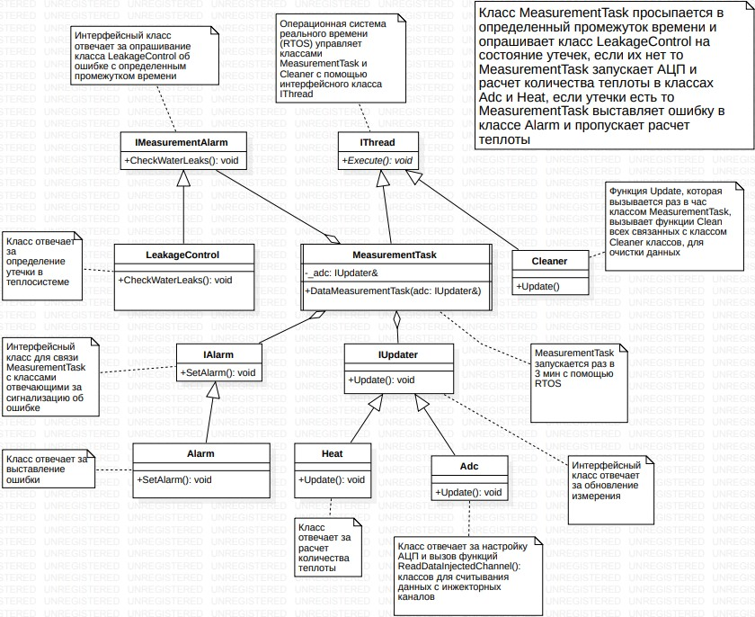
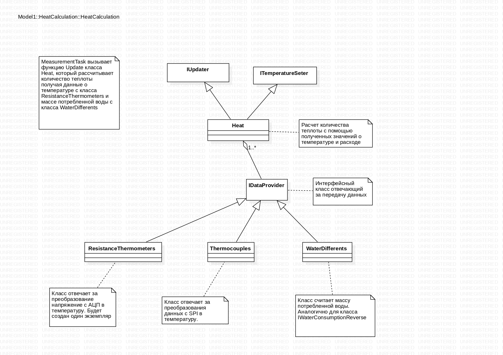
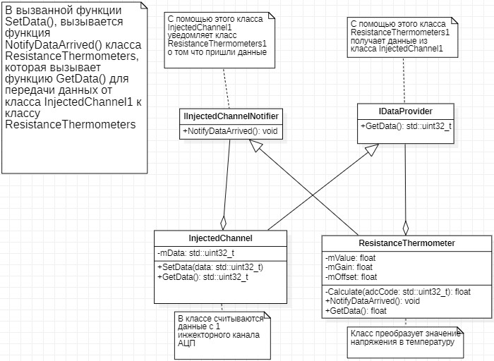
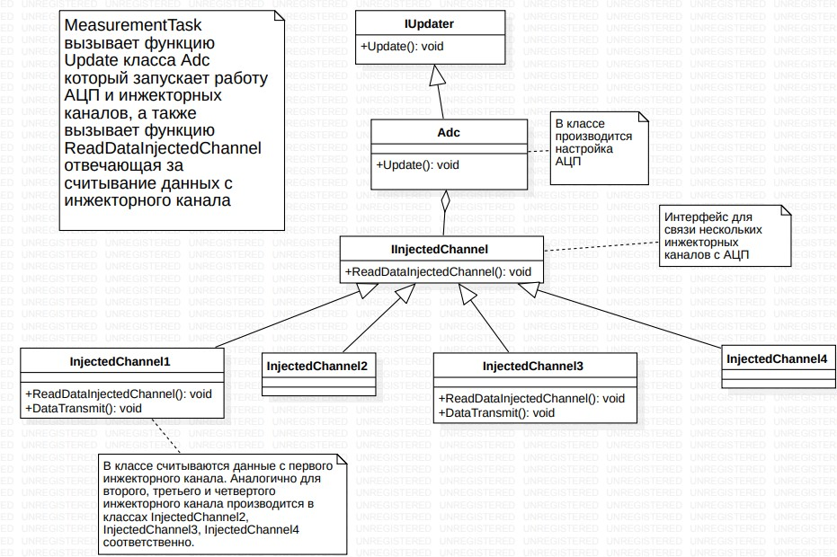
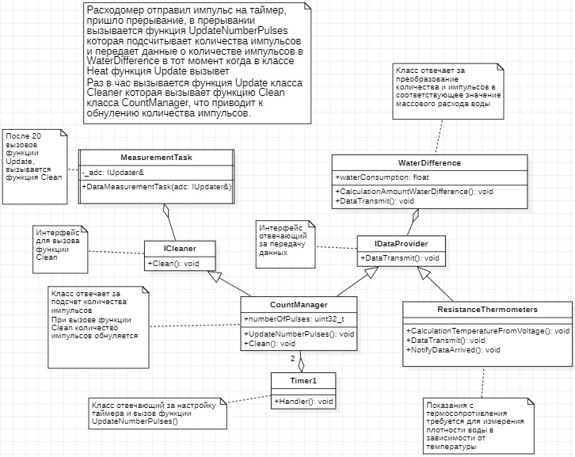

:toc: macro

= Описание архитектуры

Условно архитектура программы разделена несколько частей: 

* MeasurementTask;
* HeatCalculation;
* MeasurementTemperatureResistance;
* Adc;
* WaterConsumption.

== MeasurementTask

.UML диаграмма группы MeasurementTask

== HeatCalculation

.UML диаграмма группы HeatCalculation

== MeasurementTemperatureResistance

.UML диаграмма группы MeasurementTemperatureResistance

== Adc

.UML диаграмма группы Adc

== WaterConsumption

.UML диаграмма группы Adc
