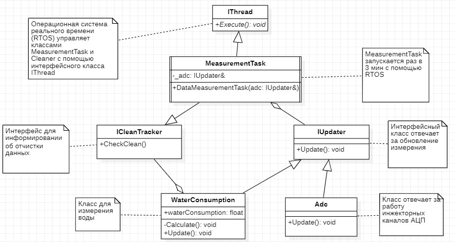
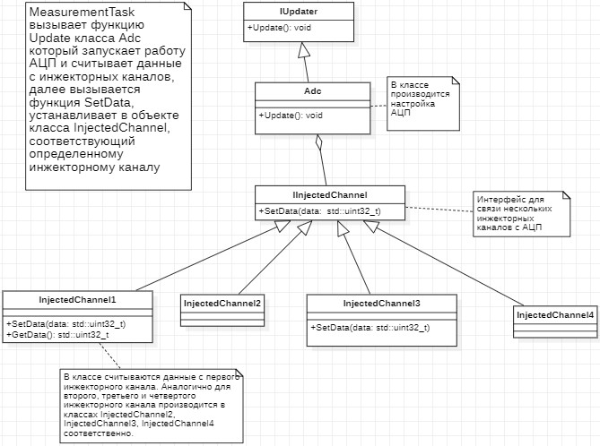

:toc: macro

= Описание архитектуры

Условно архитектура программы разделена несколько частей: 

toc::[]

== MeasurementTask

.UML диаграмма группы MeasurementTask

Класс *MeasurementTask* содержит функции *_Execute_*, в которой расположен бесконечный цикл, *_CleanCheck_*, который возвращает значение флага отчистки и *_ResetCleanChecker_*, который обнуляет значение флага отчистки. Класс также имеет приватную функцию *_UpdateCleanFlag_*, которая контролирует момент выставления флага об отчистке данных. +
Система реального времени вызывает функцию *_Execute_*, в бесконечном цикле сначала вызывается функция *_Update_* классов *Adc* и *WaterConsumption*, при этом для *WaterConsumption* два раза для двух объектов класса, далее *_UpdateCleanFlag_*, а после переходит в режим ожидания на 3 мин. +
В функции *_UpdateCleanFlag_* переменная _mCounter_ увеличивается на единицу. Далее производится сравнение _mCounter_ с переменной _oneHourCounts_, где _oneHourCounts_ отношение количества мс в одном часе к периоду ожидания в мс, если они равны _mCounter_ обнуляется и выставляется флаг _mIsCleanNeeded_ сигнализирующий о необходимости об отчистке данных. +
Функция *_CleanCheck_* возвращает состояние флага _mIsCleanNeeded_, а функция *_ResetCleanChecker_* его обнуляет. Вызывает их класс *WaterConsumption*.

.measurementTask.h
[source, cpp]
----
#ifndef MEASUREMENTTASK
#define MEASUREMENTTASK

#include <cstdint> // for std::uint8_t
#include <chrono> // for 'ms' literal
#include "thread.hpp" //For OsWrapper::Thread
#include "icleantracker.h" // for ICleanTracker

class MeasurementTask : public OsWrapper::Thread<512>, public ICleanTracker
{
  public:
    MeasurementTask(IUpdater& adc, IUpdater& waterConsumptionDirect, IUpdater& waterConsumptionReverse) : 
      mAdc(adc),
      mWaterConsumptionDirect(waterConsumptionDirect),
      mWaterConsumptionReverse(waterConsumptionReverse){}
    void Execute() override
    {
      for(;;)
      {
        mAdc.Update();
        mWaterConsumptionDirect.Update();
        mWaterConsumptionReverse.Update();
        UpdateCleanFlag();
        Sleep(mCalculationPeriod); // TODO ïîìåíÿòü íà 3 ìèí
      }
    }
    bool CleanCheck() const override
    {
      return mIsCleanNeeded;
    }
    void ResetCleanChecker() override
    {
      mIsCleanNeeded = false;
    }
private:
  const std::chrono::milliseconds mCalculationPeriod = 3000ms;
  const std::uint32_t oneHourCounts = 3600000ms / mCalculationPeriod;
  IUpdater& mAdc; 
  IUpdater& mWaterConsumptionDirect;
  IUpdater& mWaterConsumptionReverse;
  std::uint8_t mCounter = 0U;
  bool mIsCleanNeeded = false;
  void UpdateCleanFlag()
  {
    mCounter++;
    if(mCounter == oneHourCounts) 
    {
      mCounter = 0U;
      mIsCleanNeeded = true;
    }   
  }
  
};

#endif //MEASUREMENTTASK
----

.iUpdater.h
[source, cpp]
----
#ifndef IUPDATER
#define IUPDATER

class IUpdater
{
  public:
    virtual void Update() const = 0;
  
};
#endif
----

.icleantracker.h
[source, cpp]
----
#ifndef ICLEANTRACKER
#define ICLEANTRACKER

class ICleanTracker
{
public:
    virtual bool CleanCheck() const = 0;
    virtual void ResetCleanChecker() = 0;
};

#endif
----

== Adc

.UML диаграмма группы Adc

Класс *adc* отвечает вызов функций классов для считывания данных с инжекторных каналов. В классе на данный момент реализован считывание 4 инжекторных каналов. 

.adc.h
[source, cpp]
----
#ifndef ADC
#define ADC

#include "iUpdater.h" // for IUpdater
#include "iinjectedchannel.h" // for IInjectedChannel

#include "adc1registers.hpp" // for ADC1
#include "adccommonregisters.hpp" // for ADC

template<auto& ...injectedChannels>
class Adc : public IUpdater
{
public:
  void Update() override
  {
    
    ADC1::CR2::JSWSTART::On::Set(); //Start Conversation
    while(!ADC1::SR::JEOC::ConversionComplete::IsSet())
    {
    }
    

    mInjectedChannels[0]->SetData(ADC1::JDR1::JDATA::Get()); // TODO may go beyond the bounds of the array if you pass a smaller array
    mInjectedChannels[1]->SetData(ADC1::JDR2::JDATA::Get());
    mInjectedChannels[2]->SetData(ADC1::JDR3::JDATA::Get());
    mInjectedChannels[3]->SetData(ADC1::JDR4::JDATA::Get());
  }
private:
    std::array<IInjectedChannel*, sizeof ...(injectedChannels)> mInjectedChannels = {static_cast<IInjectedChannel*> (&injectedChannels)... };
  
};
#endif
----

Функция *_Update_* класса *Adc* который запускает работу АЦП и считывает данные с инжекторных каналов, далее вызывается функция *_SetData_*, интерфейса *IInjectedChannel*, который в свою очередь устанавливает данные в объекте класса *InjectedChannel*, соответствующий определенному инжекторному каналу. Установленные данные необходимо передать в другой класс, за передачу данных отвечает интерфейс *IDataProvider* с функцией *_GetData_*.

.iinjectedchannel.h
[source, cpp]
----
#ifndef IINJECTEDCHANNEL
#define IINJECTEDCHANNEL

class IInjectedChannel
{
  public:
    virtual void SetData(std::uint32_t data) = 0;
};

#endif
----

.idataprovider.h
[source, cpp]
----
#ifndef IDATAPROVIDER
#define IDATAPROVIDER

class IDataProvider
{
  public:
    virtual std::uint32_t GetData() const = 0;
};

#endif
----

Класс *InjectedChannel*, разбит на заголовочный файл .h и файл исходного кода .cpp.

.injectedchannel.h
[source, cpp]
----
#ifndef INJECTEDCHANNEL
#define INJECTEDCHANNEL

#include <cstdint> // for std::uint32_t
#include "iinjectedchannel.h" // for IInjectedChannel 
#include "idataprovider.h" // for IDataProvider

class InjectedChannel : public IInjectedChannel, IDataProvider
{
  public:
    void SetData(std::uint32_t data) override;
    
    std::uint32_t GetData() const override;
  private:
    std::uint32_t mData;
};

#endif
----

.injectedchannel.cpp
[source, cpp]
----
#include "injectedchannel.h" // for InjectedChannel

void InjectedChannel::SetData(std::uint32_t data)
{
  mData = data;
}

std::uint32_t InjectedChannel::GetData() const
{
  return mData;
}
----

Часть кода, отвечающая за объявление объектов класса *InjectedChannel*. 

.main.cpp
[source, cpp]
----

InjectedChannel channelResistanceThermometerDirect;
InjectedChannel channelResistanceThermometerReverse;
InjectedChannel channelPressureMeter1;
InjectedChannel channelPressureMeter2;
Adc<channelResistanceThermometerDirect, channelResistanceThermometerReverse, channelPressureMeter1, channelPressureMeter2> adc1;
MeasurementTask measurementTask(adc1);

----

== MeasurementTemperatureResistance

.UML диаграмма группы MeasurementTemperatureResistance
image::UML_Diag_MeasurementTemperatureResistance.jpg[]

Вначале создадим интерфейс *IInjectedChannelNotifare* для уведомления класса  *ResistanceThermometer* о том что пришли данные. Класс *ResistanceThermometer*, отвечает за преобразования кода с АЦП с инжекторного канала в температуру, полученного из класса *InjectedChannel* с помощью агрегации интерфейса *IDataProvider*.

.iinjectedchannelnotifare.h
[source, cpp]
----
#ifndef IINJECTEDCHANNELNOTIFARE
#define IINJECTEDCHANNELNOTIFARE

class IInjectedChannelNotifare
{
  public:
      virtual void NotifyDataArrived() = 0;
};

#endif
----

Класс *ResistanceThermometer*, разбит на заголовочный файл .h и файл исходного кода .cpp. В функции *_Calculate_* производится преобразования кода с АЦП в температуру. В формуле преобразования угловой коеффициент k и коеффициент смещения b задаются в конструктор при объявлении объекта класса.

.resistancethermometer.h
[source, cpp]
----
#ifndef RESISTANCETHERMOMETER
#define RESISTANCETHERMOMETER

#include <cstdint> // for std::uint32_t
#include <limits> // std::numeric_limits
#include "idataprovider.h" // for IDataProvider and IFloatDataProvider
#include "iinjectedchannelnotifier.h" // for IInjectedChannel 

class ResistanceThermometer : public IInjectedChannelNotifier, public IFloatDataProvider
{
  public:
    ResistanceThermometer(IDataProvider& dataProvider, float gain, float offset) : 
      mDataProvider(dataProvider), 
      mGain(gain),
      mOffset(offset)
    {
    }
    void NotifyDataArrived() override;
    float GetData() const override;
  private:
    float Calculate(std::uint32_t adcCode);
    IDataProvider& mDataProvider;
    float mValue = std::numeric_limits<float>::signaling_NaN();
    float mGain = std::numeric_limits<float>::signaling_NaN();
    float mOffset = std::numeric_limits<float>::signaling_NaN();
    
};

#endif
----

.resistancethermometer.cpp
[source, cpp]
----
#include "resistancethermometer.h" //for ResistanceThermometers
#include <iostream>                   // for std::cout

void ResistanceThermometer::NotifyDataArrived()
{
  mValue = Calculate(mDataProvider.GetData());
  std::cout << mValue << std::endl; // TODO delete 
}

float ResistanceThermometer::Calculate(std::uint32_t adcCode)
{
  mValue = mGain * static_cast<float>(adcCode) + mOffset; 
  return mValue;
}

float ResistanceThermometer::GetData() const
{
  return mValue;
}
----

Изменим injectedchannel.h так чтобы класс мог агрегировать интерфейс *IInjectedChannelNotifare*.

.injectedchannel.h
[source, cpp]
----
#ifndef INJECTEDCHANNEL
#define INJECTEDCHANNEL

#include <cstdint> // for std::uint32_t
#include "iinjectedchannel.h" // for IInjectedChannel 
#include "idataprovider.h" // for IDataProvider
#include "iinjectedchannelnotifare.h" // for IInjectedChannel 

class InjectedChannel : public IInjectedChannel, public IDataProvider
{
  public:
    InjectedChannel(IInjectedChannelNotifare& notifare) : mNotifare(notifare)
    {
    }
    void SetData(std::uint32_t data) override;
    
    std::uint32_t GetData() const override;
  private:
    std::uint32_t mData;
    IInjectedChannelNotifare& mNotifare;
};

#endif
----

Был добавлен интерфейсный класс *IFloatDataProvider* в файле idataprovider.h для передачи данных типа float из класса *ResistanceThermometer*.

.idataprovider.h
[source, cpp]
----
#ifndef IDATAPROVIDER
#define IDATAPROVIDER

class IDataProvider
{
  public:
    virtual std::uint32_t GetData() const = 0;
};

class IFloatDataProvider 
{
  public:
    virtual float GetData() const = 0;
};

#endif
----

Часть кода, отвечающая за объявление объектов классов.

.main.cpp
[source, cpp]
----
extern ResistanceThermometer ResistanceThermometerDirect;
extern ResistanceThermometer ResistanceThermometerReverse;

InjectedChannel channelResistanceThermometerDirect(static_cast<IInjectedChannelNotifier&>(ResistanceThermometerDirect));
InjectedChannel channelResistanceThermometerReverse(static_cast<IInjectedChannelNotifier&>(ResistanceThermometerReverse));

ResistanceThermometer ResistanceThermometerDirect(static_cast<IDataProvider&>(channelResistanceThermometerDirect), 1.0f, 0.0f);
ResistanceThermometer ResistanceThermometerReverse(static_cast<IDataProvider&>(channelResistanceThermometerReverse), 1.0f, 0.0f);

Adc<channelResistanceThermometerDirect, channelResistanceThermometerReverse> adc1;
MeasurementTask measurementTask(adc1);
----

== WaterConsumption

.UML диаграмма группы WaterConsumption
image::UML_Diag_WaterConsumption.jpg[]

Класс *Timer1* с приходом прерывания вызывает функцию *_UpdateNumberPulses_* класса *CountManager*, который подсчитывает количество импульсов.

.timer1.h
[source, cpp]
----
#ifndef TIMER1
#define TIMER1

#include "tim1registers.hpp"            // for TIMER 1
#include "countmanager.h"               // for CountManager

class Timer1
{
  public:
    Timer1(CountManager& countManager) : mCountManager(countManager) { }
    void handler()
    {
      if(TIM1::SR::CC1IF::InterruptPending::IsSet())
      {
        mCountManager.UpdateNumberPulses();
      }
      TIM1::SR::CC1IF::NoInterruptPending::Set();
    }
  private:
    CountManager& mCountManager;
    std::uint32_t counters = 0U;
};
#endif
----

Создадим класса *CountManager*, который подсчитывает количество импульсов функцией *_UpdateNumberPulses_* и передает их в класс *WaterConsumption* с помощью функции *_GetData_*. При вызове функции *_Clean_* обнуляет количество импульсов. Функцию *_Clean_* вызывает с помощью интерфейса *IClean* класс *WaterConsumption*.

.countmanager.h
[source, cpp]
----
#ifndef COUNTMANAGER
#define COUNTMANAGER

#include <cstdint> // for std::uint32_t
#include "idataprovider.h" // for IDataProvider

class CountManager : public IDataProvider
{
  public:
    std::uint32_t UpdateNumberPulses();
    std::uint32_t Clean();
    std::uint32_t GetData() const override;
  private:
    std::uint32_t numberPulses = 0U; 
};
#endif
----

.countmanager.cpp
[source, cpp]
----
#include "countmanager.h"

std::uint32_t CountManager::UpdateNumberPulses()
{
  return numberPulses++;
}

std::uint32_t CountManager::Clean()
{
  numberPulses = 0U;
}

std::uint32_t CountManager::GetData() const
{
  return numberPulses;
}
----

Создадим класс *WaterConsumption*, который с помощью функции *_Calculate_* подсчитывает массовый расход воды, с помощью данных о количестве импульсов и температуре полученных от агрегированных классов *IDataProvider* и *IFloatDataProvider* соответственно.
При этом функция *_Calculate_* вызывается фунцией *_Update_*, далее определяется состояние флага с помощью функции *_CleanCheck_*, нужно ли отчистить данные, если да то вызывается функции Clean для отчистки данных и ResetCleanChecker для обнуления флага.

.waterconsumption.h
[source, cpp]
----
#ifndef WATERCONSUMPTION
#define WATERCONSUMPTION

#include <cstdint> // for std::uint32_t
#include <limits> // std::numeric_limits
#include "idataprovider.h" // for IDataProvider and IFloatDataProvider
#include "icleantracker.h"      // for iCleanTracker
#include "icleaner.h"           // for ICleaner
#include "iUpdater.h" // for IUpdater

class WaterConsumption : public IUpdater
{
public:
  WaterConsumption(IDataProvider& dataProvider, IFloatDataProvider& floatDataProvider,
                   ICleanTracker& iCleanTracker, ICleaner& iCleaner) : 
      mDataProvider(dataProvider), 
      mFloatDataProvider(floatDataProvider),
      mCleanTracker(iCleanTracker),
      mCleaner(iCleaner)
  {
    
  }
  void Update() override;
  const IDataProvider& mDataProvider;
  const IFloatDataProvider& mFloatDataProvider;
  ICleanTracker& mCleanTracker;
  ICleaner& mCleaner;
  float waterConsumption = std::numeric_limits<float>::signaling_NaN();
private:
  float Calculate(std::uint32_t numberPulses, float temp) const;
  float PulsesPerLiter = 7.5f;
  float Coefficient1ForWaterDensity = 995.7f;
  float Coefficient2ForWaterDensity = 0.984f;  
  float Coefficient3ForWaterDensity = 0.000483f;
};
#endif
----

.waterconsumption.cpp
[source, cpp]
----
#include "waterconsumption.h"
#include <iostream>                   // for std::cout

void WaterConsumption::Update()
{
  waterConsumption = Calculate(mDataProvider.GetData(), mFloatDataProvider.GetData());
  if(mCleanTracker.CleanCheck())
  {
    mCleaner.Clean();
    mCleanTracker.ResetCleanChecker();
  }
  std::cout <<  waterConsumption << std::endl; // TODO delete 
}

float WaterConsumption::Calculate(std::uint32_t numberPulses, float temp) const
{
  return (numberPulses / PulsesPerLiter) * 
    (Coefficient1ForWaterDensity / (Coefficient2ForWaterDensity + Coefficient3ForWaterDensity * temp));
}
----

== Объявление объектов класса в main

.main.cpp
[source, cpp]
----
extern ResistanceThermometer ResistanceThermometerDirect;
extern ResistanceThermometer ResistanceThermometerReverse;

extern MeasurementTask measurementTask;

InjectedChannel channelResistanceThermometerDirect(static_cast<IInjectedChannelNotifier&>(ResistanceThermometerDirect));
InjectedChannel channelResistanceThermometerReverse(static_cast<IInjectedChannelNotifier&>(ResistanceThermometerReverse));

ResistanceThermometer ResistanceThermometerDirect(static_cast<IDataProvider&>(channelResistanceThermometerDirect), 1.0f, 0.0f);
ResistanceThermometer ResistanceThermometerReverse(static_cast<IDataProvider&>(channelResistanceThermometerReverse), 1.0f, 0.0f);

CountManager pulseWaterFlowDirect;
CountManager pulseWaterFlowReverse;

Timer1 timer1(pulseWaterFlowDirect);

WaterConsumption waterConsumptionDirect(static_cast<IDataProvider&>(pulseWaterFlowDirect), 
                                   static_cast<IFloatDataProvider&>(ResistanceThermometerDirect),
                                   static_cast<ICleanTracker&>(measurementTask),
                                   static_cast<ICleaner&>(pulseWaterFlowDirect));
WaterConsumption waterConsumptionReverse(static_cast<IDataProvider&>(pulseWaterFlowReverse), 
                                   static_cast<IFloatDataProvider&>(ResistanceThermometerReverse),
                                   static_cast<ICleanTracker&>(measurementTask),
                                   static_cast<ICleaner&>(pulseWaterFlowDirect));

Adc<channelResistanceThermometerDirect, channelResistanceThermometerReverse> adc1;
MeasurementTask measurementTask(adc1, waterConsumptionDirect, waterConsumptionReverse);
----