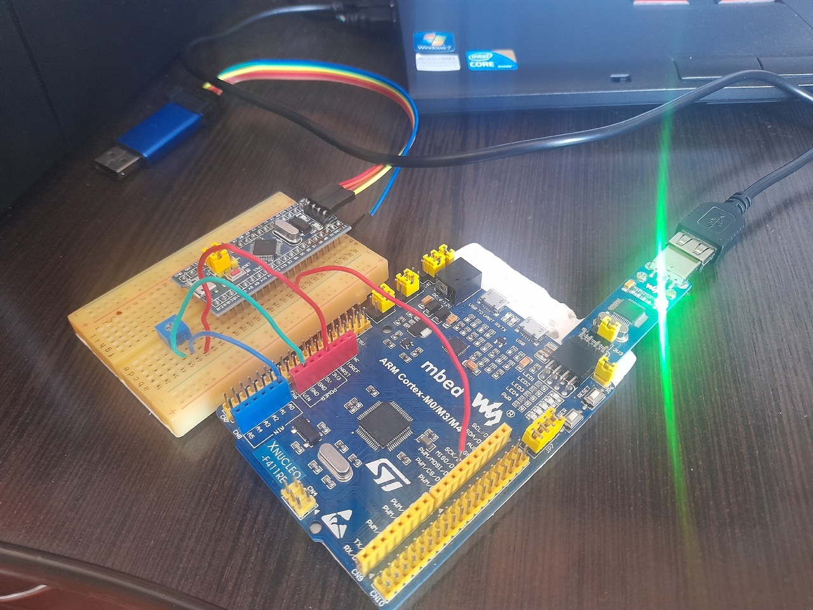
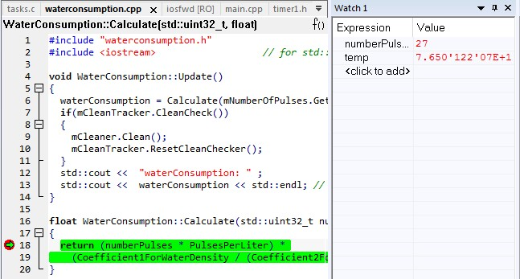
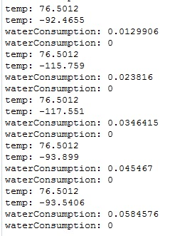

:toc: macro 

include::Titul.adoc[]

== Оглавление

toc::[]

include::Сourse_option_9.adoc[]

== Введение

Цель курсовой работы разработка тепловычислителя для индивидуального домовладения.

Тепловычислитель – это средство измерений, предназначенное для определения количества теплоты по поступающим на его вход сигналам от средств измерений параметров теплоносителя.

Для расчета тепловой энергии требуется показания о температуре и массовом расходе в начале и в конце трубопровода.

Для контроля утечки требуется снять показания давления в начале и конце трубопровода.

include::Requirements_analysis.adoc[]

include::Architecture_description.adoc[]

== Проведение испытаний

Необходимо провести испытания измерения массового расхода. Порт А0 настроенный на первый 
канал АЦП подключили к подстроечному резистору и выставили напряжение соответствующее 76,5 °C. +
Далее на микроконтроллере STM32F103C8T6 был настроен ШИМ сигнал, который посылает сигнал каждую секунду. +
Собрали схему: 

.Схема подключения двух микроконтроллеров

Запустив отладку микроконтроллера STM32F411, была установлена точка остановы в функции *_Calculate_*, для отслеживания количества импульсов, которое после 27 секунд измерения было равно 27.

.Точка остановы в функции *_Calculate_*

Теоретически значение массового расхода должно быть равно: +
stem:[ G = 27 * 0,00222 * (995,7 / (0,984 + 0,000483 * t)) / 1000 = 0,058 кг] 

В терминале значение температуры и массового расхода были следующие:

.Измерение воды

== Заключение

Таким образом, было разработано программное обеспечение для модуля измерения массового расхода для тепловычислителя индивидуального домовладения. 

