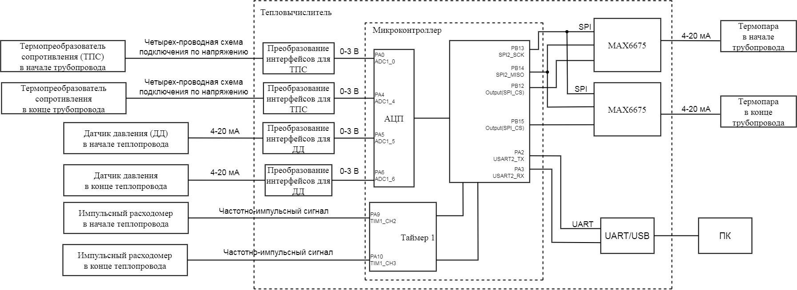

[.text-center]
Министерство науки и высшего образования Российской Федерации +
Федеральное государственное автономное образовательное учреждение +
высшего образования «Южно-Уральский государственный университет» +
(национальный исследовательский университет) +
Высшая школа электроники и компьютерных наук +
Кафедра «Информационно-измерительная техника»

[.text-center]
дисциплина: 1.Ф.П1.06 (Программное обеспечение измерительных процессов)

[.text-center]
Анализ требований

[.text-right]
Работу принял, доцент +
______/ С.В. Колодий / +
______2024 г.

[.text-right]
Автор работы +
студент группы КЭ-413 +
______/ А.И. Давлетбаев / +
______2024 г.

[.text-center]
Челябинск 2024

== Оглавление

toc::[]

== Введение

Цель курсовой работы разработка тепловычислителя для индивидуального домовладения.

Тепловычислитель – это средство измерений, предназначенное для определения количества теплоты по поступающим на его вход сигналам от средств измерений параметров теплоносителя.

Для расчета тепловой энергии требуется показания о температуре и массовом расходе в начале и в конце трубопровода.

Для контроля утечки требуется снять показания давления в начале и конце трубопровода.

== Окружение программного обеспечения

Раздел определяет требования к программному обеспечению разрабатываемого тепловычислителя. Представлен обзор модулей, интерфейсов и оборудования, с которыми разрабатываемое программное обеспечение должно взаимодействовать и определены внутренние и внешние интерфейсы, которые должны поддерживать разрабатываемое программное обеспечение.

=== Окружение программы

.Верхнеуровневая архитектура приложения

.Датчики используемые в системе
[cols="1,2"]
|===
|Наименование модуля |Назачение модуля 

|Термопреобразователь сопротивления в начале теплопровода
|Платиновый термопреобразователи сопротивления https://www.ktopoverit.ru/prof/opisanie/41646-09.pdf[Pt100] предназначены для измерения температуры в начале теплопровода.

|Термопреобразователь сопротивления в конце теплопровода
|Платиновый термопреобразователи сопротивления https://www.ktopoverit.ru/prof/opisanie/41646-09.pdf[Pt100] предназначены для измерения температуры в конце теплопровода.

|Датчик давления в начале теплопровода
|Для контроля утечки воды из теплосистемы установлен датчик давления для вычисления давления с точностью  в начале теплопровода. Выходной сигнал датчика токовая петля 4-20 мА.

|Датчик давления в конце теплопровода
|Для контроля утечки воды из теплосистемы установлен датчик давления для вычисления давления с точностью  в конце теплопровода. Выходной сигнал датчика токовая петля 4-20 мА.

|Термопара в начале теплопровода
|Термопара типа К (хромель-алюмель) с выходом 4-20 мА и диапазоном измеряемых температур 0-1024 °C.

|Термопара в конце теплопровода
|Термопара типа К (хромель-алюмель) с выходом 4-20 мА и диапазоном измеряемых температур 0-1024 °C.

|Импульсный расходомер в начале теплопровода
|Импульсный расходомер с частотно-импульсным выходом предназначен для измерения массы воды в начале теплопровода

|Импульсный расходомер в конце теплопровода
|Импульсный расходомер с частотно-импульсным выходом предназначен для измерения массы воды в конце теплопровода

|Таймер 1
|Таймер 1 используется для вычисления количества импульсов подключенного импульсных расходомеров в начале и конце теплопровода, для измерения количества импульсов используется https://www.st.com/resource/en/reference_manual/rm0383-stm32f411xce-advanced-armbased-32bit-mcus-stmicroelectronics.pdf#page=307&zoom=100,89,482[регистр захвата таймера 1].

|АЦП
|Внутренний 12 битный АЦП микроконтроллера отвечает за преобразования аналогового сигнала в цифровой. На вход АЦП подключено 4 датчика.

|MAX6675
|Модуль производит преобразование аналогового сигнала 4-20 мА в цифровой по интерфейсу SPI. Микросхема имеет 12 битный АЦП и точность микросхемы 0,25 °C. 

|Преобразование интерфейсов для термопреобразователя сопротивления
|Модуль для подключения ТПС по четырехпроводной схеме подключения и передачи информационного сигнала в виде 0-3 В на микроконтроллер.

|Преобразование интерфейсов для датчика давления
|Модуль производит преобразование входного сигнала 4-20 мА в выходной 0-3 В.

|UART/USB
|Для связи микроконтроллера и персонального компьютера используются стандарты передачи даныых UART и USB, для их согласования нужен модуль UART/USB. В связи с этим в микроконтроллере установлен чип https://www.silabs.com/documents/public/data-sheets/CP2102-9.pdf[CP2102]. 

|===

Расчет тепловой энергии:: 

Формула расчета тепловой энергии: +
stem:[Q = G1 * c1 * (t1 - tхв) - G2 * c2 * (t2 - tхв)] +
где G1 - масса воды прошедшей в начале труборповода за час, т;
t1 - температура воды в начале труборповода, °C;
c1 - удельная теплоемкость воды при температуре t1, Дж/(кг * °C);
G2 - масса воды прошедшей в конце труборповода за час, т;
t2 - температура воды в конце труборповода, °C;
c2 - удельная теплоемкость воды при температуре t2, Дж/(кг * °C);
tхв - температура холодной воды, используемой для подпитки системы теплоснабжения, определяется в виде константы равной 5 °C.

Масса воды G1 и G2 рассчитывается, как G: +
stem:[ G = V * p(t)] +
где V -  объем воды, л; +
p(t) – зависимость плотности воды от температуры.

stem:[ p(t) = 995,7 / (0,984 + 0,000483 * t)] +
где t - температура, °C.

stem:[ V = k(dt) / K(p)] +
где k(dt) - количество импульсов за минуту; +
K(p) - множитель, равный отношение импульсов на литр воды.

Измерение температуры воды t1 и t2 производится, как с помощью термопреобразователя сопротивления, так и термопары. 

Данные о температуре с термопары и MAX6675 поступают по интерфейсу SPI, на канале MISO считывают 12-битный результат, где последовательность всех нулей, соответствует 0 °C, тогда как последовательность всех единиц, соответствует +1023,75 °C. Следовательно одному биту соответствует 0,25 °C. +
Формула преобразования данных с чипа MAX6675 в температуру t: +
stem:[ t = D / Kprt]
где D - данные о температуре с чипа MAX6675;
Kprt - коэффициент для преобразования данных D в температуру t равный 4.

Для измерения температуры с термосопротивления, используется формула для расчета значения сопротивления при температуре t, в диапазоне измерения t = 0...850 °C. + 
stem:[ R(t) = 100 + 0,39083 * t - 5,775 * 10^(-5) * t^(2)] +
где R(t) - сопротивление в зависимости от температуры t, Ом. +
Для измерения сопротивления по четырех проводной схеме подключения с высокой точностью на термосопротивление подается ток 1 мА.

Удельная теплоемкость воды с1 и с2 зависят от температур t1 и t2 соответственно. Приблеженная формула зависимости теплоемкости с от температуры t: +
stem:[ c(t) = 4194 - 1,15 * t + 1,5 * 10^(-2) * t^(2)]

При преобразования токового сигнала 4-20 мА в напряжение, току 4 мА соответствует напряжение 0,4 В, а 20 мА соответсвует 2 В.
Измеряя с помощью встроенного АЦП микроконтроллера напряжение 0,4 и 2 В соответствует нижний и верхний предел диапазона измерения. +
stem:[ p = (Vp - 0,4) * Kprp ] +
где p - давление воды, атм;
Vp - напряжение с ацп, В;
Kprp - коэффициент для преобразования напряжения в давление.

