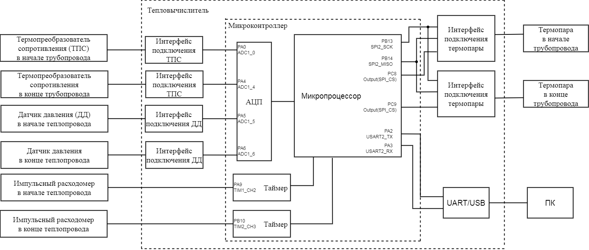

[.text-center]
Министерство науки и высшего образования Российской Федерации +
Федеральное государственное автономное образовательное учреждение +
высшего образования «Южно-Уральский государственный университет» +
(национальный исследовательский университет) +
Высшая школа электроники и компьютерных наук +
Кафедра «Информационно-измерительная техника»

[.text-center]
дисциплина: 1.Ф.П1.06 (Программное обеспечение измерительных процессов)

[.text-center]
Анализ требований

[.text-right]
Работу принял, доцент +
______/ С.В. Колодий / +
______2024 г.

[.text-right]
Автор работы +
студент группы КЭ-413 +
______/ А.И. Давлетбаев / +
______2024 г.

[.text-center]
Челябинск 2024

== Оглавление

toc::[]

== Введение

== Окружение программного обеспечения

Раздел определяет требования к программному обеспечению разрабатываемого тепловычислителя. Представлен обзор модулей, интерфейсов и оборудования, с которыми разрабатываемое программное обеспечение должно взаимодействовать и определены внутренние и внешние интерфейсы, которые должны поддерживать разрабатываемое программное обеспечение.

=== Окружение программы

.Верхнеуровневая архитектура приложения

.Датчики используемые в системе
[cols="1,2"]
|===
|Наименование модуля |Назачение модуля 

|Термопреобразователь сопротивления в начале теплопровода
|Платиновый термопреобразователи сопротивления https://www.ktopoverit.ru/prof/opisanie/41646-09.pdf[Pt100] предназначены для измерения температуры в начале теплопровода.

|Термопреобразователь сопротивления в конце теплопровода
|Платиновый термопреобразователи сопротивления https://www.ktopoverit.ru/prof/opisanie/41646-09.pdf[Pt100] предназначены для измерения температуры в конце теплопровода.

|Датчик давления в начале теплопровода
|Требуется для вычисления давления в начале и конце теплопроводе.

|Датчик давления в конце теплопровода
|Требуется для вычисления давления в начале и конце теплопроводе.

|Термопара в начале теплопровода
|тип К

|Термопара в конце теплопровода
|тип К

|Импульсный расходомер в начале теплопровода
|

|Импульсный расходомер в конце теплопровода
|

|Таймер 1
|Таймер 1 используется для вычисления количества импульсов подключенного импульсного расходомера в начале теплопровода, для измерения количества импульсов используется https://www.st.com/resource/en/reference_manual/rm0383-stm32f411xce-advanced-armbased-32bit-mcus-stmicroelectronics.pdf#page=307&zoom=100,89,482[регистр захвата таймера 1].

|Таймер 2
|Таймер 2 используется для вычисления количества импульсов подключенного импульсного расходомера в конце теплопровода, для измерения количества импульсов используется https://www.st.com/resource/en/reference_manual/rm0383-stm32f411xce-advanced-armbased-32bit-mcus-stmicroelectronics.pdf#page=368&zoom=100,89,230[регистр захвата таймера 2].

|АЦП
|Внутренний 12 битный АЦП микроконтроллера отвечает за преобразования аналогового сигнала в цифровой. На вход АЦП подключено 4 датчика.

|UART/USB
|Для связи микроконтроллера и персонального компьютера используются стандарты передачи даныых UART и USB, для их согласования нужен модуль UART/USB. В связи с этим в микроконтроллере установлен чип https://www.silabs.com/documents/public/data-sheets/CP2102-9.pdf[CP2102]. 

|===

Импульсный расходомер:: Требуется для счета массы пройденной воды по теплопроводу начале и конце.

Масса воды G: +
stem:[ G = V * p(t)] +
где V -  объем воды, л; +
p(t) – зависимость плотности воды от температуры.

stem:[ p(t) = 995,7 / (0,984 + 0,000483 * t)] +
где t - температура, °C.

stem:[ V = k(dt) / K(p)] +
где k(dt) - количество импульсов за минуту; +
K(p) - множитель, равный отношение импульсов на литр воды.

.Преобразователи интерфейсов в тепловычислителе
[cols="2,1,1"]
|===
|Подключаемый датчик |Сигнал/тип подключения на входе преобразователя |Сигнал на выходе преобразователя 

|Датчик давления
|4-20 мА
|0-3 В

|Термопреобразователь сопротивления
|Четырехпроводная схема подключения
|0-3 В

|Термопара
|4-20 мА
|SPI

|===

Интерфейсы подключения термопары:: Модули производят преобразование аналогового сигнала в цифровой. Микросхема имеет 12 битный АЦП и точность микросхема 0,25 °C. Модули подключается к микроконтроллеру по интерфесу SPI.
Оба интерфейса подключения термопар подключаются к одному пину SPI2_SCK и одному пину SPI2_MISO. На микроконтроллере два пина настроены на вывод с подтяжкой к единице, пины подключены к входу SPI_CS интерфейсов. Для снятия показания с термопары, на пин SPI_CS требуемого датчика, подается 0.  
