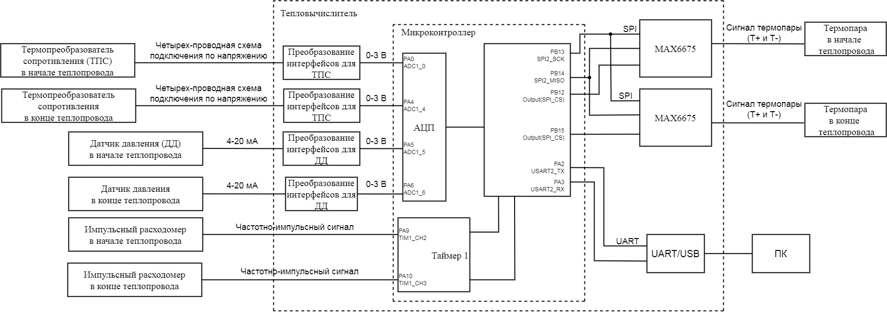

== Окружение программного обеспечения

Раздел определяет требования к программному обеспечению разрабатываемого тепловычислителя. Представлен обзор модулей, интерфейсов и оборудования, с которыми разрабатываемое программное обеспечение должно взаимодействовать и определены внутренние и внешние интерфейсы, которые должны поддерживать разрабатываемое программное обеспечение.

.Верхнеуровневая архитектура приложения

.Датчики используемые в системе
[cols="1,2"]
|===
|Наименование модуля |Назачение модуля 

|Термопреобразователь сопротивления в начале теплопровода
|Платиновый термопреобразователи сопротивления https://www.ktopoverit.ru/prof/opisanie/41646-09.pdf[Pt100] предназначены для измерения температуры в начале теплопровода.

|Термопреобразователь сопротивления в конце теплопровода
|Платиновый термопреобразователи сопротивления https://www.ktopoverit.ru/prof/opisanie/41646-09.pdf[Pt100] предназначены для измерения температуры в конце теплопровода.

|Датчик давления в начале теплопровода
|Для контроля утечки воды из теплосистемы установлен датчик давления для вычисления давления с точностью  в начале теплопровода. Выходной сигнал датчика токовая петля 4-20 мА.

|Датчик давления в конце теплопровода
|Для контроля утечки воды из теплосистемы установлен датчик давления для вычисления давления с точностью  в конце теплопровода. Выходной сигнал датчика токовая петля 4-20 мА.

|Термопара в начале теплопровода
|Термопара типа К (хромель-алюмель) с выходом 4-20 мА и диапазоном измеряемых температур 0-1024 °C.

|Термопара в конце теплопровода
|Термопара типа К (хромель-алюмель) с выходом 4-20 мА и диапазоном измеряемых температур 0-1024 °C.

|Импульсный расходомер в начале теплопровода
|Импульсный расходомер YF-S201 с частотно-импульсным выходом предназначен для измерения массы воды в начале теплопровода

|Импульсный расходомер в конце теплопровода
|Импульсный расходомер YF-S201 с частотно-импульсным выходом предназначен для измерения массы воды в конце теплопровода

|Таймер 1
|Таймер 1 используется для вычисления количества импульсов подключенного импульсных расходомеров в начале и конце теплопровода, для измерения количества импульсов используется https://www.st.com/resource/en/reference_manual/rm0383-stm32f411xce-advanced-armbased-32bit-mcus-stmicroelectronics.pdf#page=307&zoom=100,89,482[регистр захвата таймера 1].

|АЦП
|Внутренний 12 битный АЦП микроконтроллера отвечает за преобразования аналогового сигнала в цифровой. На вход АЦП подключено 4 датчика.

|MAX6675
|Модуль производит преобразование аналогового сигнала 4-20 мА в цифровой по интерфейсу SPI. Микросхема имеет 12 битный АЦП и точность микросхемы 0,25 °C. 

|Преобразование интерфейсов для термопреобразователя сопротивления
|Модуль для подключения ТПС по четырехпроводной схеме подключения и передачи информационного сигнала в виде 0-3 В на микроконтроллер.

|Преобразование интерфейсов для датчика давления
|Модуль производит преобразование входного сигнала 4-20 мА в выходной 0-3 В.

|UART/USB
|Для связи микроконтроллера и персонального компьютера используются стандарты передачи даныых UART и USB, для их согласования нужен модуль UART/USB. В связи с этим в микроконтроллере установлен чип https://www.silabs.com/documents/public/data-sheets/CP2102-9.pdf[CP2102]. 

|===

== Расчет тепловой энергии

Формула расчета тепловой энергии: +
stem:[Q = G1 * c1 * (t1 - t_(хв)) - G2 * c2 * (t2 - t_(хв))] +
где G1 - масса воды прошедшей в начале труборповода за час, т; +
t1 - температура воды в начале труборповода, °C; +
c1 - удельная теплоемкость воды при температуре t1, Дж/(кг * °C); +
G2 - масса воды прошедшей в конце труборповода за час, т; +
t2 - температура воды в конце труборповода, °C; +
c2 - удельная теплоемкость воды при температуре t2, Дж/(кг * °C); +
tхв - температура холодной воды, используемой для подпитки системы теплоснабжения, определяется в виде константы равной 5 °C.

=== Расчет массы воды

Масса воды G1 и G2 рассчитывается, как G: +
stem:[ G = V * p(t)] +
где V -  объем воды, л; +
p(t) – зависимость плотности воды от температуры.

stem:[ p(t) = 995,7 / (0,984 + 0,000483 * t)] +
где t - температура, °C.

stem:[ V = P * K(p)] +
где P - количество импульсов; +
K(p) - множитель, равный отношение литров воды на один импульс, равный 0.00222.

=== Расчет температуры

Измерение температуры воды t1 и t2 производится, как с помощью термопреобразователя сопротивления, так и термопары. 

==== Расчет температуры с помощью термопары

Данные о температуре с термопары и MAX6675 поступают по интерфейсу SPI, на канале MISO считывают 12-битный результат, где последовательность всех нулей, соответствует 0 °C, тогда как последовательность всех единиц, соответствует +1023,75 °C. Следовательно одному биту соответствует 0,25 °C. +
Формула преобразования данных с чипа MAX6675 в температуру t: +
stem:[ t = D / K_(prt)] +
где D - данные о температуре с чипа MAX6675; +
 K_(prt) - коэффициент для преобразования данных D в температуру t равный 4.

==== Расчет температуры с помощью термопреобразователя сопротивления

Измерение температуры с термопреобразователя сопротивления производится снятием напряжения на термосопротивлении внутренним АЦП микроконтроллера. +
В диапазоне температур от 0 до 150 °C зависимость температуры от сопротивления для термопреобразователя сопротивления pt100 линейна, следовательно зависимость температуры от напряжения описывается уравнением прямой: +
stem:[ y = k * x + b] +
где y - точка на оси ординат; +
k - угловой коэффициент; +
x - точка на оси абсцисс; +
b - значение показывает, насколько она смещена относительно оси абсцисс. 

Для нахождения коеффициента k используем уравнение прямой по двум точкам: +
stem:[ k = (y - y_(0)) / (x - x_(0))] +
где y - максимальное значение напряжения; +
y_(0) - минимальное значение напряжения; +
x - максимальное значение диапазона температуры; +
x_(0) - минимальное значение диапазона температуры;

Так как у_(0) соответствует t_(0) = 0 °C, а у соответствует t = 150 °C. Значения x_(0) и x определяется следующим образом, подключаем эталонное сопротивление равное 100 Ом и 157,3251 Ом, что для ТПС pt100 соответствует температурам 0 °C и 150 °C, далее снимаем напряжения V_(0) для сопротивления 100 Ом и V для сопротивления 157,3251 Ом. 

Тогда формула нахождения коеффициента k примет вид: +
stem:[ k = (t - t_(0)) / (V - V_(0)) = 150 / (V - V_(0)) ]

Формула нахождения коеффициента b имеет следующий вид: +
stem:[ b = y - k * x = V - k * t]

Формула преобразования напряжения в температуру для термопреобразователя сопротивления: +
stem:[t = k * V + b ]

Удельная теплоемкость воды с1 и с2 зависят от температур t1 и t2 соответственно. Приблеженная формула зависимости теплоемкости с от температуры t: +
stem:[ c(t) = 4194 - 1,15 * t + 1,5 * 10^(-2) * t^(2)]

=== Расчет давления

При преобразования токового сигнала 4-20 мА в напряжение, току 4 мА соответствует напряжение 0,4 В, а 20 мА соответсвует 2 В.
Измеряя с помощью встроенного АЦП микроконтроллера напряжение от 0,4 до 2 В соответствует нижний и верхний предел диапазона измерения. +
stem:[ p = (V_(p) - 0,4) * K_(prp) ] +
где p - давление воды, атм; +
V_(p) - напряжение с ацп, В; +
K_(prp) - коэффициент для преобразования напряжения в давление.

== Погрешность расчета количества теплоты

Относительная погрешность термочувствительного элемента для термопреобразователя сопротивления pt100 равна 1%.

Расходомер YF-S201 имеет относительную погрешность 5%.

Неисключенная систематическая погрешность (НСП) результата образуется из неисключенных систематических погрешностей средств измерения температуры и расхода в начале и конце теплопровода.

Доверительные границы НСП δ(P) вычисляют по формуле: +
stem:[ δ(P) = +- k sqrt(Σ ((Θ_(i))^(2)) )  ] +
где δ_(i) - граница i-й неисключенной состовляющей систематической погрешности; +
k - коэффициент, определяемый принятой доверительной вероятностью Р.

Определим доверительную вероятность Р = 0,95, при этом коэффициент k = 1,1. Тогда доверительная граница НСП в относительной форме будет: +
stem:[ δ(0,95) = +- 1,1 sqrt( ((δ_(t1))^(2)) + ((δ_(t2))^(2)) + ((δ_(G1))^(2)) + ((δ_(G2))^(2)) ) = +- 1,1 * sqrt( ( 0,01^(2)) + 0,01^(2) + 0,05^(2) + 0,05^(2) ) = 7,932%] +
где δ_(t1) - погрешность для ТПС в начале теплопровода; +
δ_(t2) - погрешность для ТПС в конце теплопровода; +
δ_(G1) - погрешность для импульсного расходомера в начале теплопровода; +
δ_(G2) - погрешность для импульсного расходомера в конце теплопровода.

Таким образом систематическая погрешность для расчета количества тепловой энергии при доверительной вероятности Р = 0,95 равна 7,9%.
